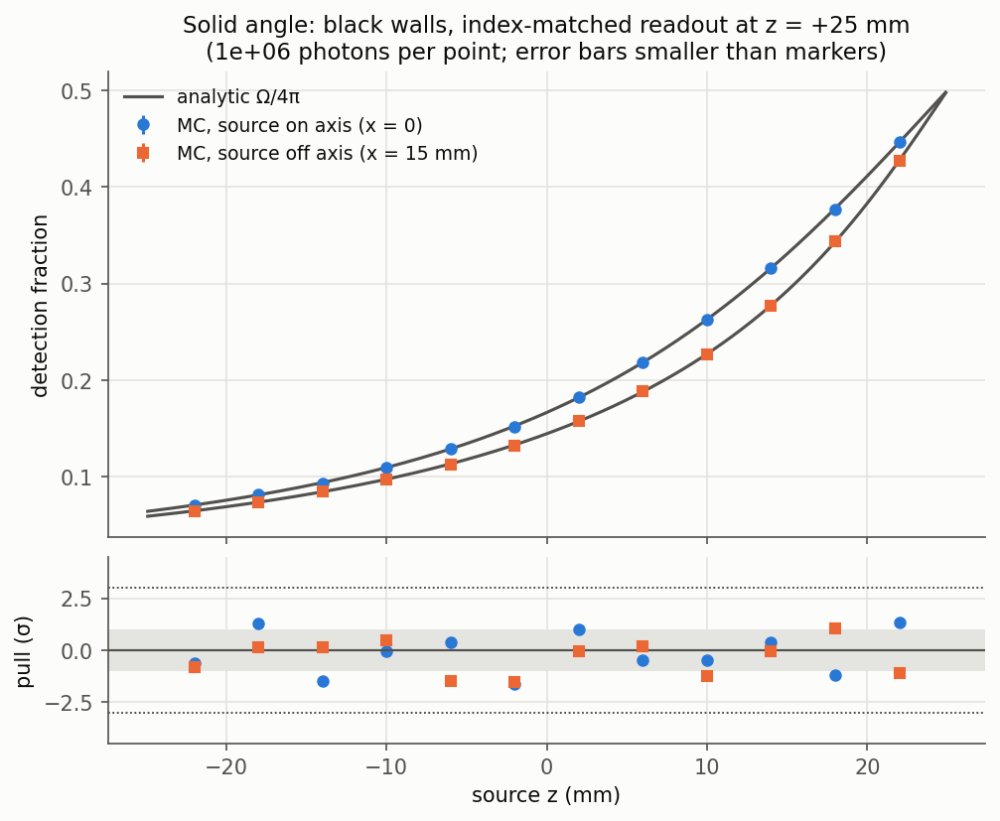
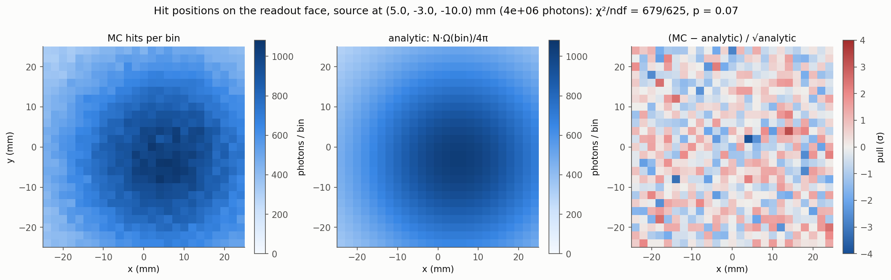
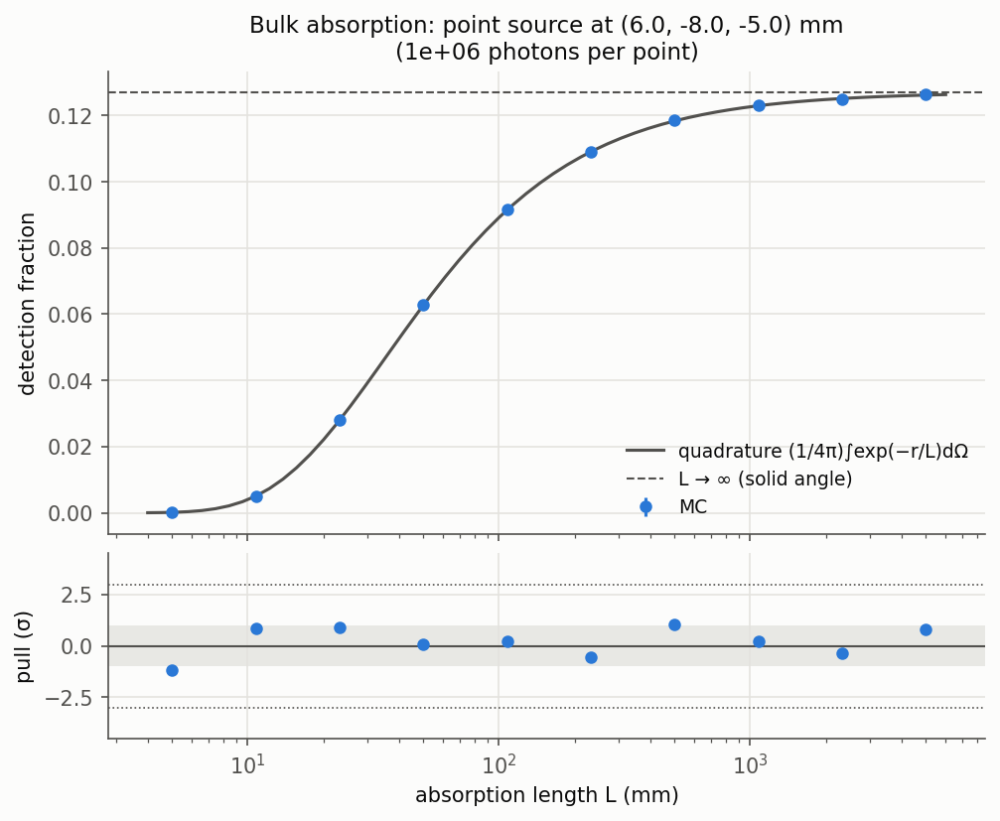
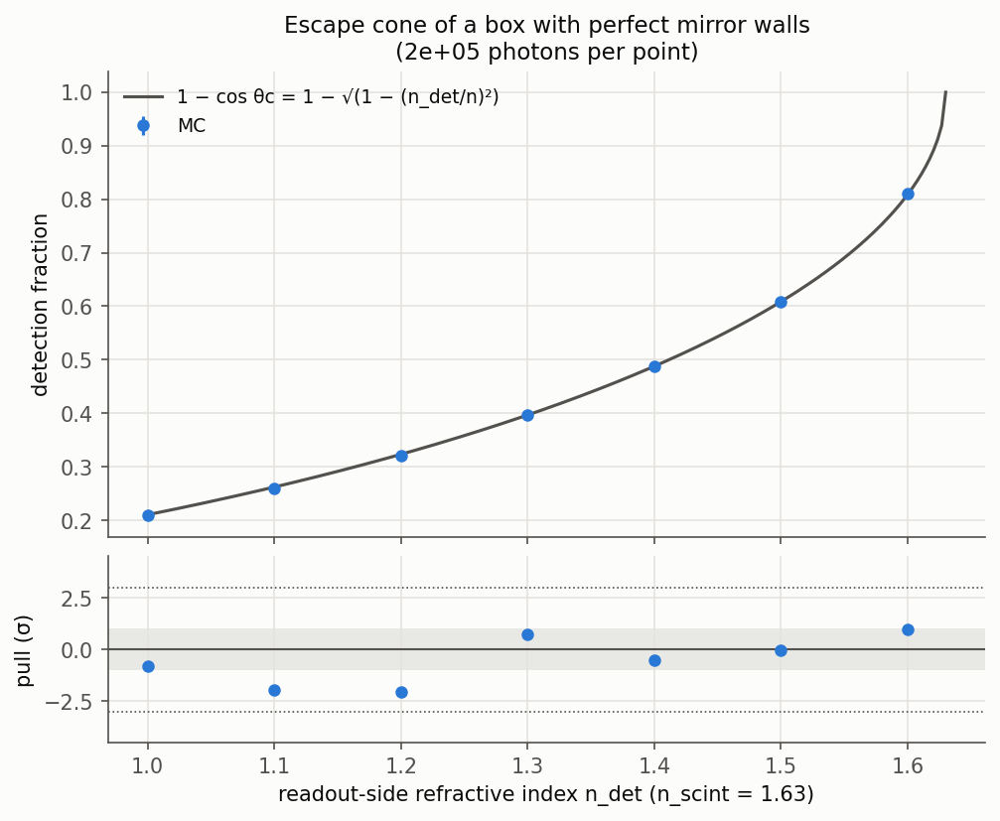
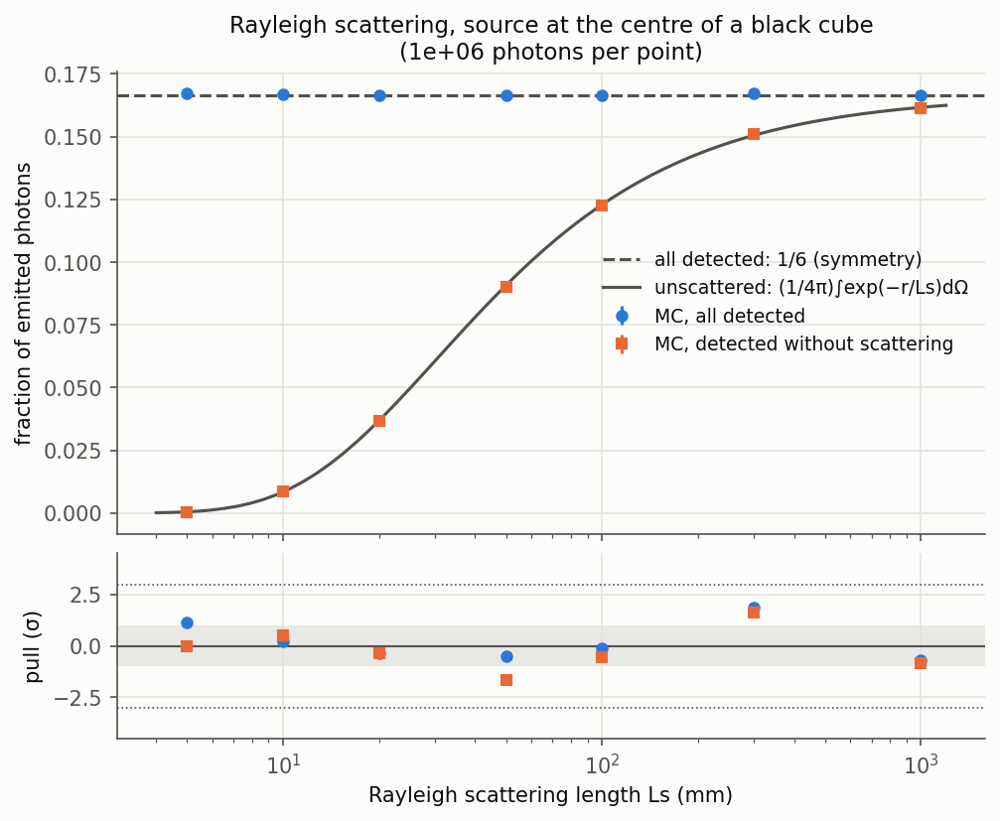
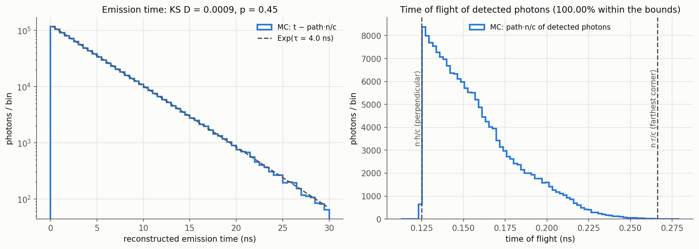
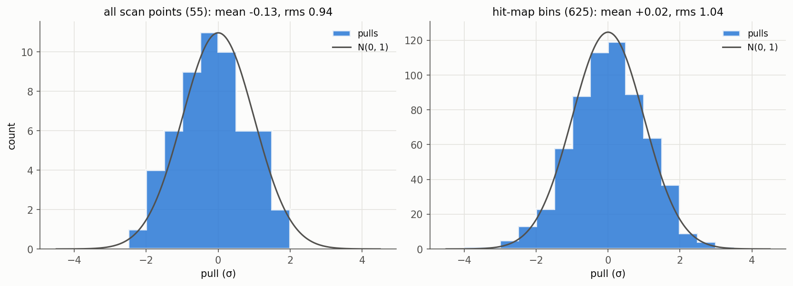
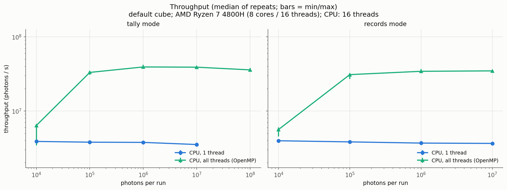
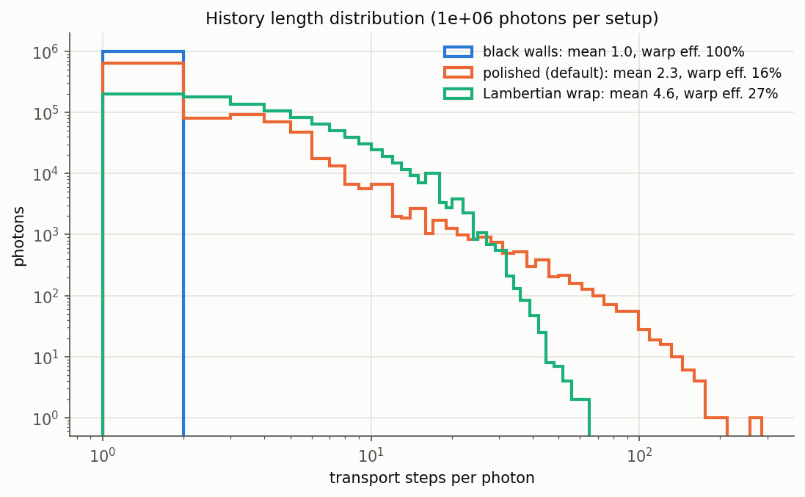

# gpu-optical-photon-toy

A small, self-contained **optical-photon transport code for a scintillator
box**: a CPU reference implementation and a CUDA implementation that share
**the same physics source code**. The two are validated against each other
and against analytic results.

The physics is deliberately simple and fully specified, so that every result
can be checked. The point of the project is the engineering around it:
- one physics code for host and device;
- counter-based random numbers that make CPU and GPU comparable photon by
  photon;
- an honest account of where floating-point histories diverge;
- statistical validation;
- an analysis of what limits a history-based GPU kernel.

> **Status of the GPU results.** The CUDA code (`src/gpu/`, `tests/test_gpu.cpp`,
> `apps/optphot_compare.cpp`) was developed on a machine without a CUDA
> toolkit.
> - Everything on the CPU path is built and tested here: 42 tests pass, and
>   so do the validation figures below.
> - The CUDA sources are compiled by the `cuda-compile` CI job and run by
>   [`notebooks/run_on_colab.ipynb`](notebooks/run_on_colab.ipynb) on a Colab
>   GPU.
> - GPU validation, CPU/GPU comparison and GPU benchmark figures are
>   produced by that notebook. Sections that need them say so explicitly.

---

## Contents

1. [Motivation](#motivation)
2. [Physics model and its simplifications](#physics-model)
3. [Code design](#code-design)
4. [Build and run](#build-and-run)
5. [Validation](#validation)
6. [CPU vs GPU, and why histories can differ](#cpu-vs-gpu)
7. [Benchmarks and profiling](#benchmarks)
8. [Known limitations](#limitations)
9. [Next steps](#next-steps)
10. [Repository layout](#layout)

---

<a id="motivation"></a>
## 1. Motivation

In large detectors, optical photons (scintillation and Cherenkov light) can
dominate the cost of a full Geant4 simulation. A single MeV of energy
deposited in a plastic or organic scintillator produces ~10⁴ photons, and
each photon is tracked through many boundary interactions. Photons do not
interact with each other, so the problem is embarrassingly parallel. That is
why GPU offloading of optical photons is attractive: see for example
[Opticks](https://github.com/simoncblyth/opticks) with NVIDIA OptiX, and
the GPU efforts around Geant4 (Celeritas, AdePT).

This toy reproduces the core of that problem in a setting small enough to
validate exhaustively:
- one photon-transport routine;
- one geometry;
- a handful of well-defined processes.

On top of that it studies the questions that matter when moving such code to
a GPU:
- Can the CPU and GPU really run the *same* physics?
- How do you show that they agree, and how exactly?
- Where does performance go, and what limits it?

<a id="physics-model"></a>
## 2. Physics model and its simplifications

Units are mm and ns throughout.

| | model |
|---|---|
| **Geometry** | Rectangular box `size_x × size_y × size_z`, default 5 × 5 × 5 cm, centred at the origin. The **+z face is the readout**; the other five faces share one surface model. |
| **Material** | Refractive index `n_scint` = 1.63 (stilbene-like). Absorption length `abs_length` = 1 m. Rayleigh scattering length `scat_length` = ∞ (disabled). Monochromatic. |
| **Source** | Point source at (`src_x`, `src_y`, `src_z`) or uniform in the volume. Isotropic emission. Emission time from a single exponential with decay constant `tau` = 4 ns. |
| **Bulk processes** | Exponential absorption. Rayleigh scattering with the unpolarised phase function p(cos θ) ∝ 1 + cos²θ, sampled by exact Cardano inversion of its CDF. |
| **Polished faces** | Unpolarised Fresnel reflection/refraction to an outside medium of index `n_out`, including total internal reflection. A refracted photon is lost (*escaped*). |
| **Black faces** | Perfect absorbers. |
| **Specular reflector** | Mirror with reflectivity R, painted directly on the surface (no air gap); otherwise absorbed. Equivalent to Geant4 UNIFIED `polishedfrontpainted`. |
| **Lambertian reflector** | Cosine-law diffuse reflector with reflectivity R, painted directly on the surface; otherwise absorbed. Equivalent to Geant4 `groundfrontpainted`. |
| **Readout face** | Smooth interface to a medium of index `n_det` (window or optical grease). Fresnel-transmitted photons are **detected**; the code records their arrival time, hit position and number of boundary interactions. |
| **Termination** | Detected, absorbed in the bulk, absorbed at a surface, escaped, or the `max_steps` safety limit (default 10 000) is reached. |

### The transport loop

[`include/optphot/transport.hpp`](include/optphot/transport.hpp) contains the
transport loop, a standard "next event" scheme. Each step does the following:
1. Sample a distance to absorption and a distance to scattering.
2. Compute the distance to the box boundary.
3. The smallest of the three wins.

Re-sampling both interaction distances at every step is exact, because the
exponential distribution is memoryless. All Bernoulli decisions use
`u ≤ p` with u in (0, 1], so total internal reflection (R = 1) is certain
and R = 0 is impossible.

### Simplifications, stated explicitly

- **Monochromatic and non-dispersive.** One refractive index, so phase and
  group velocity are both c/n. There is no wavelength dependence of n,
  absorption or scattering.
- **Unpolarised.** The Fresnel reflectance is the s/p average at each
  interaction, and no polarisation vector is carried. After a reflection,
  real light is partially polarised, which this model ignores. Geant4's
  `G4OpBoundaryProcess` and `G4OpRayleigh` *do* track polarisation.
- **No surface roughness.** There is no micro-facet model, unlike UNIFIED
  with `sigma_alpha`. The "painted" reflectors have no air gap or
  dielectric layer.
- **The outside world is empty.** Photons refracted out of a polished face
  never come back.
- **Ideal photodetector.** Detection means transmission through the readout
  face: quantum efficiency 1, no angular or wavelength response.
- **Simplified scintillation.** Single decay constant, no rise time, no
  re-emission or wavelength shifting. Photons start from a given point or
  uniformly in the volume, rather than along charged-particle steps.
- **Single precision everywhere** (see §6). It is ample for millimetre-scale
  geometry: the float epsilon times 50 mm is about 3 nm.

### Mapping to Geant4

| here | Geant4 |
|---|---|
| `abs_length` | `ABSLENGTH` → `G4OpAbsorption` |
| `scat_length` | `RAYLEIGH` → `G4OpRayleigh` (polarised there) |
| `n_scint`, `n_det`, `n_out` | `RINDEX` → `G4OpBoundaryProcess`, `dielectric_dielectric`, `polished` |
| `specular` / `lambertian` + R | `polishedfrontpainted` / `groundfrontpainted` + `REFLECTIVITY` |
| `tau` | `SCINTILLATIONTIMECONSTANT1` (single component) |
| detection by transmission | a sensitive volume behind the window, or `EFFICIENCY` on a surface |

<a id="code-design"></a>
## 3. Code design

```
include/optphot/        header-only physics, __host__ __device__ (OPT_HD)
  hd.hpp                portability macros, constants
  philox.hpp            Philox4x32-10 counter-based RNG, per-photon stream
  pmath.hpp             log / sincos / cbrt: platform library or portable versions
  vec3.hpp sampling.hpp fresnel.hpp geometry.hpp
  transport.hpp         transport_photon(): the complete history of one photon
  backend.hpp           host API of both backends (records & tally modes)
  analytic.hpp stats.hpp compare.hpp   validation helpers (host only)
src/cpu/cpu_backend.cpp CPU loop (+ OpenMP)
src/gpu/gpu_backend.cu  CUDA kernels (records, tally) — built only with WITH_CUDA=ON
src/core/               config parsing, .npy output, comparison tools
apps/                   optphot (CLI), optphot_compare (CPU vs GPU), optphot_bench
tests/                  Catch2 unit, validation, config and GPU tests (ctest)
python/                 analysis, validation scans, plots
notebooks/              Colab notebook (CUDA build, GPU tests, figures)
```

**One physics code.** Every physics function is marked `OPT_HD`. That
expands to `__host__ __device__` under `nvcc` and to nothing in a plain C++
compiler, so the CPU-only build needs no CUDA. Both the CPU loop and the CUDA
kernel call the same `transport_photon(params, photon_id)`.

**Counter-based RNG.**
- Philox4x32-10 ([`philox.hpp`](include/optphot/philox.hpp)) is a pure
  function `(counter, key) → 128 bits`. It is verified against the Random123
  known-answer vectors.
- Photon *i* uses counter `{block, 0, i}` and key = seed. Its random numbers
  are therefore independent of which thread or core runs it, and of the
  order.
- That makes CPU and GPU comparable photon by photon, and makes the CPU
  result independent of the OpenMP thread count. Both properties are tested.

**GPU v1 is history-based, one thread per photon**
([`gpu_backend.cu`](src/gpu/gpu_backend.cu)). There are two output modes:

| mode | how | why |
|---|---|---|
| `records` | Thread *i* writes photon *i*'s record into **structure-of-arrays** device buffers. Neighbouring threads write neighbouring addresses, so the stores are coalesced. No atomics; the output is deterministic. Chunked to bound device memory. | Needed for photon-by-photon comparison and detailed analysis. Costs 29 bytes per photon, plus the device→host copy. |
| `tally` | Grid-stride loop. Each block accumulates its own histograms in **shared memory** with 32-bit atomics, then adds them to global memory once with 64-bit atomics. | Production-style: kilobytes leave the GPU instead of gigabytes. **Integer** counters make the result independent of the order of the atomics, so tallies are bit-reproducible. A test checks this across block sizes. |

**No fast-math.**
- The host compiler uses `-ffp-contract=off`, so x86 results do not depend
  on `-march`.
- `nvcc` keeps its IEEE defaults for division and square root.
- FMA contraction on the device is a CMake switch (`OPTPHOT_CUDA_FMAD`).

**Configuration and output.**
- Configuration uses `key = value` files ([`configs/`](configs)) and
  `--key value` overrides on the command line.
- Results are written as plain NumPy `.npy` arrays plus `meta.json`, so
  `np.load` reads them directly; no converter is needed.

The GPU concepts used in the code (kernels, warps, divergence, coalescing,
atomics, RNG streams, transfers, floating point) are explained for a C++/MC
programmer in [`docs/LEARNING_NOTES.md`](docs/LEARNING_NOTES.md).

<a id="build-and-run"></a>
## 4. Build and run

Requirements:
- CMake ≥ 3.18 and a C++17 compiler.
- Optionally OpenMP.
- For the GPU: the CUDA toolkit (nvcc) and an NVIDIA GPU.
- Catch2 is fetched automatically.

```bash
# CPU only (works on any machine)
cmake -S . -B build -DCMAKE_BUILD_TYPE=Release
cmake --build build -j
ctest --test-dir build --output-on-failure
```

```bash
# With CUDA (set the architecture of your GPU: 75 = T4 / GTX 16xx, 86 = RTX 30xx, 89 = L4 / RTX 40xx)
cmake -S . -B build-gpu -DCMAKE_BUILD_TYPE=Release -DWITH_CUDA=ON -DCMAKE_CUDA_ARCHITECTURES=75
cmake --build build-gpu -j
ctest --test-dir build-gpu --output-on-failure
```

| CMake option | default | meaning |
|---|---|---|
| `WITH_CUDA` | OFF | build the GPU backend, `optphot_compare` and the GPU tests |
| `WITH_OPENMP` | ON | multi-threaded CPU backend if OpenMP is found |
| `OPTPHOT_CUDA_FMAD` | ON | allow `nvcc` to fuse a·b+c into FMA (nvcc's default) |
| `OPTPHOT_PORTABLE_MATH` | OFF | use the portable `log/sincos/cbrt` from `pmath.hpp` (see §6) |

No GPU at hand? Open [`notebooks/run_on_colab.ipynb`](notebooks/run_on_colab.ipynb)
in Google Colab with a GPU runtime. It builds everything with CUDA and runs
all tests, the GPU validation, the CPU/GPU comparison and the benchmarks, then
packs up the figures.

Running:

```bash
./build/apps/optphot --config configs/default.cfg --n_photons 1e6 --threads 0 --out runs/default
```

```bash
./build/apps/optphot --surface lambertian --reflectivity 0.97 --n_det 1.5 --source volume --mode tally
```

```bash
./build-gpu/apps/optphot --backend gpu --config configs/wrapped_lambertian.cfg --n_photons 1e8 --mode tally
```

```bash
./build-gpu/apps/optphot_compare --config configs/default.cfg --n_photons 2e6 --out results/compare/default
```

`--help` lists all settings. Python (numpy, scipy, matplotlib; see
`python/requirements.txt`):

```bash
python python/run_validation.py --exe build/apps/optphot            # validation scans + figures
```

```bash
./build/apps/optphot_bench --config configs/default.cfg --csv bench.csv
```

```bash
python python/plot_benchmarks.py bench.csv
```

```bash
python python/divergence_estimate.py --exe build/apps/optphot     # SIMT efficiency estimate
```

<a id="validation"></a>
## 5. Validation

The validation has three layers. Every statistical test uses a fixed seed,
so the tests are deterministic. The thresholds (|pull| < 4, p > 10⁻⁴) are
set so that a correct implementation passes for essentially any seed.

### 5.1 Unit tests (`tests/test_*.cpp`)

| area | checks |
|---|---|
| **RNG** | Random123 known-answer vectors. A stream is a pure function of (seed, photon id). Uniformity (χ²). No correlation between neighbouring photon streams. |
| **Fresnel** | Normal incidence ((n₁−n₂)/(n₁+n₂))². Index-matched interface never reflects, including grazing angles: the tests caught a real bug there, where 1 − cos² rounded to 1 in float and looked like TIR. TIR beyond the critical angle and continuity just below it. Brewster angle (R_p = 0). Comparison with an independent angle-form implementation in double precision over the full range. |
| **Directions** | Reflection keeps unit length and the tangential component. Refraction is unit length, obeys Snell's law and stays in the plane of incidence. Refracting back recovers the incident direction. |
| **Sampling** | Isotropic, Rayleigh (exact inverse CDF, ⟨μ²⟩ = 2/5, χ²), Lambertian (⟨cos θ⟩ = 2/3, χ²), exponential, orthonormal basis near the poles. |
| **Geometry** | Exit distances; ray end points on the reported face; 10⁵ consecutive mirror reflections that never re-hit the same face and never leave the box. |
| **Portable math** | Accuracy across the full input range: `log` ≤ 2.3 ulp, `sincos` ≤ 1·10⁻⁷ absolute, `cbrt` ≤ 1 ulp. |

### 5.2 Transport validated against analytic results

These are the C++ tests in `tests/test_transport_cpu.cpp`. The figures come
from `python/run_validation.py`, which recomputes every analytic reference
independently in scipy. All figures below were produced with the CPU backend
on 10⁶ photons per point.

**Solid angle.**
- Setup: the readout is index-matched (n_det = n_scint), the other faces are
  black, and there are no bulk processes.
- Then every photon flies in a straight line to one face, and the detection
  fraction must equal Ω/4π. Ω is the exact solid angle of the readout
  rectangle: Ω = Σ ± atan(xy / (h·√(x²+y²+h²))) over its corners.
- The C++ test checks **all six faces**, not just the readout, for five
  source positions and two box shapes. The scan below moves the source
  along z.



**Hit positions.** The expected number of hits per bin of the readout face
is the exact solid angle of that bin rectangle. The result is
χ²/ndf = 679/625 (p = 0.07), with pulls distributed as N(0, 1).



**Absorption (the analytic expectation of choice).**
- Keep the black-walled, index-matched box and turn on absorption.
- Each photon still travels in a straight line, over a distance r(Ω) to the
  wall in its direction. It survives with probability exp(−r/L).
- So P(detected) = (1/4π) ∫_readout exp(−r/L) dΩ with dΩ = h dA / r³, and
  P(absorbed in bulk) = 1 − (1/4π) ∮_all faces exp(−r/L) dΩ.
- The box has no closed form for this, but the integral is smooth. It is
  evaluated to ~10⁻¹² by composite Gauss–Legendre quadrature (C++) and
  independently by adaptive `scipy.integrate.dblquad` (Python). The two
  agree to 10⁻⁹.
- As L → ∞ the quadrature reproduces the analytic solid angle, which checks
  the quadrature itself.
- Why this test: it exercises the exponential sampling, the geometry and the
  path-length bookkeeping together, against a reference with no free
  parameters, over three decades of L.



**Escape cone of a mirror box.**
- Setup: perfect specular mirrors on five faces, no bulk processes, and a
  readout to n_det < n_scint.
- Reflections on axis-aligned walls preserve |d_x|, |d_y| and |d_z|, so a
  photon can only ever leave if |d_z| > cos θ_c. It then eventually does,
  through repeated Fresnel attempts. Every other photon is trapped by TIR
  forever.
- For isotropic emission |d_z| is uniform, so P_det = 1 − cos θ_c exactly.
- This is a sharp test of Fresnel/TIR and of specular reflection inside the
  full transport loop.



**Rayleigh scattering.**
- Setup: the source sits at the centre of a cube whose six faces all absorb
  (five black faces plus the matched readout).
- By symmetry exactly 1/6 of the photons are detected *for any scattering
  length*.
- The unscattered detected photons follow the same attenuated solid angle as
  above, with L = L_s.
- The unit tests separately check the angular distribution (1 + cos²θ).



**Timing.**
- Per photon, the path length equals |hit − source|.
- t − path·n/c reconstructs the sampled emission time, which passes a KS
  test against Exp(τ) (p = 0.45).
- 100% of times of flight lie between the perpendicular and the
  farthest-corner bounds.



**All pulls together.** The 55 scan points have pull mean −0.13 and rms 0.94;
the 625 hit-map bins have mean +0.02 and rms 1.04. Both are consistent with
N(0, 1).



Further tests cover the uniform volume source in a cube (P = 1/6), a
lossless Lambertian box (everything detected), CPU results that are
independent of the thread count, and tally mode agreeing with records mode.

<a id="cpu-vs-gpu"></a>
## 6. CPU vs GPU, and why histories can differ

### How the comparison is done

`optphot_compare` runs one configuration three times:

| run | backend | seed | used for |
|---|---|---|---|
| A | CPU | s | reference |
| B | GPU | s | **photon-by-photon** comparison with A: the fraction of records that are *bitwise identical*, and the fraction with the *same discrete history* (same fate and the same numbers of boundary interactions and scatterings) |
| C | GPU | s + 1 | **statistical** comparison with A: efficiency z-test, two-sample χ² of the arrival-time and hit-position histograms, two-sample KS of arrival times |

The statistical tests deliberately use independent seeds. With the same
seed, A and B are the *same* photons, so the samples are almost perfectly
correlated and every test passes trivially. That says nothing about whether
the GPU physics is right. The comparison tools themselves are tested on the
CPU: a deliberate physics change (n_det 1.63 → 1.5) is detected at z = 27.

The GPU tests (`tests/test_gpu.cpp`) require:
- the analytic solid-angle and absorption results on the GPU;
- at least 99% of histories with the same discrete path;
- statistical compatibility for independent seeds;
- bit-reproducible tallies across block sizes;
- records independent of chunk size and block size.

**GPU results:** run the Colab notebook. It produces
`docs/figures/compare_*.png`, `compare_history_agreement.png` and a table for
this section.

### Where and why histories diverge

Both sides use IEEE-754 single precision, but that does not make them
bit-identical:

1. **FMA contraction.** By default `nvcc` fuses `a*b + c` into a fused
   multiply-add, which rounds once instead of twice. The host build forbids
   contraction (`-ffp-contract=off`).
2. **Math library.** `logf`, `sinf`, `cosf` and `cbrtf` are accurate to 1–2
   ulp, but glibc, the Windows runtimes and CUDA's libdevice are different
   implementations, and their last bits differ for some inputs. By contrast,
   + − × ÷ √ are correctly rounded everywhere: `nvcc` keeps
   `-prec-div=true -prec-sqrt=true` unless fast-math is used, and it is not
   used here.
3. **Fast math would add more:** denormal flushing, approximate division
   and transcendentals, and (on the host) reassociation. It is deliberately
   off.

A last-bit difference in a position or time is harmless in itself. But it
propagates, and sooner or later it can flip a discrete decision:
- `u ≤ R` at a boundary;
- which face is nearer, at a corner;
- absorption against reaching the boundary.

From that step on, the two histories are different (both valid) Monte Carlo
histories. Such flips are rare: the margin of a decision is almost never
within an ulp.

**A CPU-only measurement of the effect.** The same seed was run with the
platform math library and with the portable math (§3), on 10⁶ photons with a
volume source, polished walls and Rayleigh scattering:
- **100%** of histories took the same discrete path;
- only **23.1%** of records were bitwise identical;
- the largest deviations were |Δt| = 1.4·10⁻⁴ ns and |Δx| = 0.025 mm, after
  many bounces.

This is the same mechanism expected between CPU and GPU. Reproduce it with
`python python/compare_runs.py runA runB` on two builds.

**Making them identical.** With `-DOPTPHOT_PORTABLE_MATH=ON
-DOPTPHOT_CUDA_FMAD=OFF`, the four transcendental functions come from
`pmath.hpp`, built only from correctly rounded operations, and nothing is
fused. Every operation is then exactly specified by IEEE-754, so CPU and GPU
histories *should* agree to the last bit. In that configuration the GPU test
**asserts** that all 10⁶ records are bitwise identical. The notebook builds
and runs this variant; its result is the definitive check.

<a id="benchmarks"></a>
## 7. Benchmarks and profiling

`optphot_bench` measures photons per second against the number of photons.
For the GPU it reports kernel time, allocation, host→device and device→host
times separately.
- Host→device is essentially zero by design: photons are generated on the
  device from (seed, id), and the parameters travel as kernel arguments.
- In a Geant4 integration the "gensteps" would have to be uploaded instead.

**CPU** (AMD Ryzen 7 4800H, 8 cores / 16 threads, MinGW-w64 GCC 13 `-O3`,
default polished cube, median of 3 runs;
data in [`docs/data`](docs/data)):

| backend | 10⁴ | 10⁵ | 10⁶ | 10⁷ | 10⁸ photons |
|---|---|---|---|---|---|
| 1 thread, tally | 3.9·10⁶ /s | 3.8·10⁶ | 3.8·10⁶ | 3.5·10⁶ | – |
| 16 threads (OpenMP), tally | 6.4·10⁶ | 3.3·10⁷ | 3.9·10⁷ | 3.9·10⁷ | 3.6·10⁷ |
| 16 threads (OpenMP), records | 5.6·10⁶ | 3.1·10⁷ | 3.4·10⁷ | 3.5·10⁷ | – |



Small runs (10⁴ photons) do not parallelise: with chunks of 4096 photons
there are only three chunks. OpenMP scales by about 10× on 8 physical cores
with SMT.

**GPU:** the notebook produces `docs/figures/benchmark_colab_*_throughput.png`
and `*_gpu_breakdown.png` (where the time goes in records mode). Colab VMs
have only 2 vCPUs, so the CPU numbers there are not a fair baseline; compare
GPU numbers against the table above.

### Divergence: what limits a history-based kernel

In the records kernel, a warp of 32 consecutive photons runs until its
*longest* history ends. Most photons finish within 1–2 steps, but a few are
trapped by TIR for hundreds of steps.
[`python/divergence_estimate.py`](python/divergence_estimate.py) replays
recorded history lengths (no GPU needed) to estimate the fraction of lanes
doing useful work. It assumes equal cost per step.

| setup | mean steps | longest | history-based | compact alive photons every 4 steps | every 2 | every step |
|---|---|---|---|---|---|---|
| black walls | 1.00 | 1 | 100% | 100% | 100% | 100% |
| polished cube (default) | 2.34 | 284 | **16%** | 49% | 74% | ~100% |
| Lambertian wrap, volume source | 4.64 | 64 | **27%** | 72% | 89% | ~100% |



Compacting *once* is not enough: it gives about 30% in the polished cube,
because the survivors' history lengths are still heavy-tailed. This is the
quantitative case for **event-based tracking**. Keep the photon state in
global memory (structure-of-arrays), advance all alive photons by a few
steps per launch, compact them, and refill. The cost is state traffic and
compaction overhead, so the right *k* must be measured.
[`docs/PROFILING.md`](docs/PROFILING.md) covers this together with the Nsight
Systems and Nsight Compute recipes, including the metric that measures active
threads per warp directly.

<a id="limitations"></a>
## 8. Known limitations

- **Physics** — see the simplifications in §2. In particular: no
  polarisation, no wavelength dependence, no surface roughness, a single
  box, ideal detection.
- **The GPU code has not been run on this development machine.** Its
  correctness rests on:
  - the shared physics code, which is fully validated on the CPU;
  - the `cuda-compile` CI job;
  - the GPU tests and comparison run in the Colab notebook.
- **GPU v1 is deliberately simple.** It is history-based with one thread per
  photon. It uses no pinned memory, no streams and no overlap of transfers
  with compute, and the 32-bit shared tallies assume fewer than 2³²
  photons per block.
- **Benchmarks.** The CPU and GPU numbers come from different machines. The
  divergence estimate assumes equal cost per step. Absolute GPU throughput
  depends strongly on the GPU model.
- **The `max_steps` limit** is a safety net. With perfect mirrors and
  n_det < n_scint, TIR-trapped photons hit it by construction; it is
  reported as a separate fate.

<a id="next-steps"></a>
## 9. Next steps

1. **Event-based tracking**: SoA photon state in global memory,
   per-interaction kernels, periodic compaction and refill, compared against
   the history-based kernel in the same framework (§7).
2. **Wavelength dependence**: sample photon energies from an emission
   spectrum, use tabulated n(λ), absorption and Rayleigh lengths, and group
   velocity from dn/dλ.
3. **Polarisation**: carry a polarisation vector and use the full Fresnel
   amplitudes, as `G4OpBoundaryProcess` and `G4OpRayleigh` do.
4. **Read Geant4 optical material properties** (`G4MaterialPropertiesTable`:
   `RINDEX`, `ABSLENGTH`, `RAYLEIGH`, `REFLECTIVITY`, …) to configure the toy
   from a real Geant4 setup.
5. **Compare with Geant4 `G4OpticalPhysics`** in an identical box, for
   example detection efficiency and arrival-time distributions for each
   surface model. This is the natural end-to-end validation of the toy.
6. **Transfers and reductions**: pinned host memory and streams to overlap
   copies with transport; warp-aggregated atomics for the tallies.
7. **Generation on the GPU from gensteps**: upload scintillation and
   Cherenkov step summaries, not photons, which is the Opticks approach.

<a id="layout"></a>
## 10. Repository layout and tooling

- `ctest` runs all C++ tests. With `ctest -V`, or by running
  `./build/tests/validation_tests` directly, you see a `[validation]` line
  for every statistical check.
- `.clang-format` defines the C++ style (Google-based, 100 columns).
- CI ([`.github/workflows/ci.yml`](.github/workflows/ci.yml)):
  - the CPU build and all tests with GCC and Clang, plus a portable-math
    variant;
  - the Python scripts run end to end;
  - `nvcc` compilation of all CUDA targets in an `nvidia/cuda` container,
    in the default and the reproducible configuration. This job compiles
    only, because hosted runners have no GPU.

## License

MIT — see [LICENSE](LICENSE).
